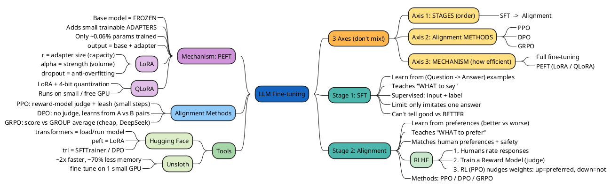

# Fine-tuning — Mind Map

A visual map of the LLM fine-tuning concepts from the Week 2 notes.

## How to read it
- **Center** = the whole topic (LLM fine-tuning)
- **Top-right (orange)** = the 3 axes that people confuse — the key framework
- **Right (teal)** = the two *stages* in order (SFT → Alignment) + RLHF
- **Left (purple)** = the efficiency *mechanism* (PEFT/LoRA/QLoRA)
- **Left (blue)** = the alignment *methods* (PPO/DPO/GRPO)
- **Left (green)** = the *tools* (Hugging Face, Unsloth)

## To view it as a picture
The block above is **PlantUML mind-map syntax**. To render it:
- Paste it into **https://www.plantuml.com/plantuml** (online), or
- Use a VS Code **PlantUML** extension, or
- Any Markdown viewer with PlantUML support
